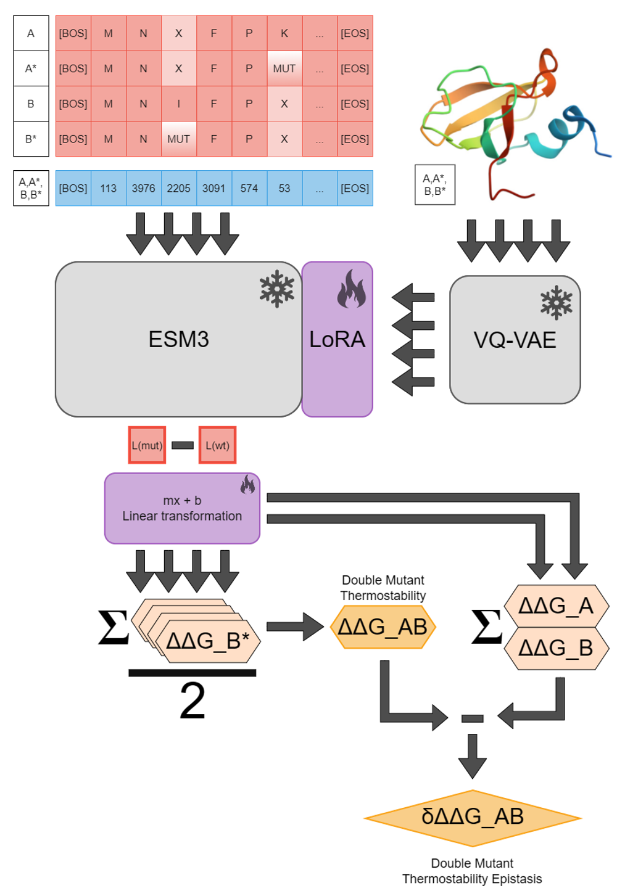

# ESM-MSR

This mutant stability predictor was created by parameter-efficient fine-tuning of ESM3-small-open (https://www.science.org/doi/10.1126/science.ads0018) on protease susceptibility assays from Tsuboyama et al (https://www.nature.com/articles/s41586-023-06328-6). It generates state-of-the-art predictions on numerous benchmark datasets including PTMUL and Ssym. This repository is designed to enable inference using this approach and facilitate reproducing results from our paper: link. We also created an interface for inference and visualization in ChimeraX. **Built with ESM**.

## Requirements

Python 3.12

CUDA 12.8

NVIDIA GPU with 24+ GB VRAM

## Recommended Installation

Clone the repo, create a conda environment, and install in editable mode

`git clone https://github.com/SKTeamLab/esm-msr.git`

`cd esm-msr`

`conda create -n msr_venv python=3.12`

`conda activate msr_venv`

`pip install torch torchvision torchaudio --index-url https://download.pytorch.org/whl/cu128`

`pip install -e .`

## Obtaining ESM3-small-open weights

We recommend downloading the weights from HuggingFace directly into data/weights. Alternatively, you can provide a Huggingface token if you have ESM3 api access.

Weights are available from https://huggingface.co/EvolutionaryScale/esm3-sm-open-v1/tree/main/data/weights. Download all files in this folder into esm-msr/data/weights, overwriting the placeholder files. You must agree to the Cambrian Non-Commercial License Agreement to get access. Note that the same license applies to our method and can be found in the LICENSE.md file. 

## Basic Usage

You must choose a LoRA adapter from LoRA_models. 'Unmasked' version are suggested for using the faster strategy, 'parallel'. Performance losses are negligible relative to using 'singles_only' models with the 'masked strategy', which performed best in our paper. The 'direct' (masked marginal) strategy is much faster for multimutants but does not correctly capture epistasis and is not recommended. All provided LoRAs have a rank of 6 and a default alpha of 12. This alpha can be lowered to obtain predictions more similar to the base ESM3 model. Choose between mode 'singles', 'doubles' or 'multi'. By default, singles or doubles modes will score all possible mutations of that type for the provided protein. Multi is designed for use with a 'subset_df', which is a csv file with columns 'wt1','pos1','mut1','wt2','pos2','mut2'...'wtn','posn','mutn' indicating which mutations of interest should be scored. This option also works with singles and doubles and is useful for benchmarking. Indices refer to the position within the provided structure file.

`python src/esm_msr/inference.py --checkpoint LoRA_models/msr_chain_unmasked/seed1_epoch\=07-val_rho_avg\=0.754.ckpt --lora_alpha 12 --input_structure path_to_structure_file --strategy parallel --mode singles`

The visualizer generates predictions using this script. You can read the GUI section to understand how inference.py can be used from the command line.

## Adding the visualizer to ChimeraX

Download and install ChimeraX (tested version: 1.11) from https://www.cgl.ucsf.edu/chimerax/download.html (free for non-commercial use)

Go to Tools -> Command Line Interface (check box)

In the command line interface at the bottom, type (replacing the /path/to/repo):

`devel install /path/to/repo/ChimeraX-ResidueScoreVisualizer`

## Using the ChimeraX GUI

The GUI workflow has two steps: 1. Make some predictions using the model; 2. Optionally visualize some aspect of those predictions.

1. **Running an External Prediction**

    1. **Open a Model**: Load a valid protein structure (PDB, mmCIF) into ChimeraX. You can click and drag structure files into the window, or directly download and open a PDB structure (example: 1ENH) using `open 1enh` from the ChimeraX command line.

    2. **Set Repositories**: In the Run External Prediction panel, browse to your esm-msr base repository. This will automatically populate the expected paths for the inference script, checkpoint, output CSV, and Python environment.
         - NOTE: if using a conda environment, you may have to paste in the actual location, which you can find using `conda env list`.
      
    3. **Specify your output location**: This CSV will be parsed to produce visualizations and can also be analyzed in Python using `pd.read_csv()`.

    3. **Configure Inference Parameters**: The settings chosen here directly dictate which visualization modes will be available downstream.
  
    - **Checkpoint Path**: Select a provided LoRA from /path/to/repo/LoRA_models or your custom trained LoRA. Y
       - You must ensure that the LoRA rank matches that checkpoint. All provided models have a rank of 6, which is the default.
       - The LoRA alpha determines how much predictions are shifted from the original model.
         - Stability predictions are optimized at alpha = 12, default.
         - Alpha lower than 12 but greater than 0 gives the model some preference to scoring based on stability compared to the base model. An alpha of 8 is recommended for the best compromise between stability and other properties.

    - **Chain ID**: Select the single chain you want to perform inference on according to its specification in the file.
   
    - **Name**: Change the index prefix for the output dataframe (useful if merging output predictions)
   
    - **Multi Paths**: Only applicable if you manually specify multimutants to predict. Sets the K_paths value to determine the number of sampling trajectories explored.

    - **Screening Mode**:

         `singles`: Exhaustively scores all single amino acid mutations. Required to use the "Standard Single-Mutant" downstream visualization.

         `doubles`: Scores double mutations (KxK pairs). Required to use the "Epistasis Mode" downstream visualization.

    - **Strategy**: Determines how the ESM model treats the sequence.

         `masked` (Default): Masks the target position(s) before prediction.
         
         `parallel`: Uses unmasked sequences for inference, providing linear scaling for multimutants.
         
         `direct`: Directly predicts the sequence without masking.

    - **Calc Distances**: If checked, the script calculates the physical 3D distances between C-alpha atoms of mutated residues and includes them in the output CSV.

   4. **Overrides (Optional)**: If provided, these settings bypass the exhaustive screening modes above:

    - Subset CSV: Upload a CSV file specifying a defined list of mutations to score. The script will automatically infer whether to run singles, doubles, or multi-mode based on the number of positions provided per row.

    - Specific Mutations: Enter a comma-separated list of precise mutations (e.g., A12C,A12C:D15E). Note: This cannot be used simultaneously with a Subset CSV.

   5. **Run**: Click Run Prediction Script. The tool will save your current structure to a temporary file, spin up a background process to run the prediction, and output a CSV.

    - For **screening singles**, expect **<1 minute inference time** on modern GPUs regardless of strategy, up to 2 minutes for large proteins (as long as VRAM is not exceeded).

    - For **screening doubles**, a full screen requires L * (L-1) / 2 predictions, and hence depends greatly on the protein length. A typical protein of 300AAs can be predicted in roughly **1 hour**.
      - You can speed this up by specifying a subset_df (especially one containing only mutations where the residues can interact)
      - You can use the parallel strategy, in which case your selected LoRA model should be an 'unmasked' variant

2. **Loading and Visualizing Scores** (once a CSV is generated or if you already have an existing CSV):

    **Standard Single-Mutant Mode**

     1. Make sure the "Epistasis Mode" checkbox is unchecked. (Requires a CSV generated using the singles screening mode).
     2. **Select visualization settings BEFORE loading CSV**:

        - **Score Threshold**: Set a minimum threshold. Only mutations above this score will be mapped as sticks.
        - **Color Backbone by Score**: Red means mutations are all predicted to be deleterious, green means there are some beneficial mutations
            - Color is based on the difference between the wild-type score and the highest-scoring mutation 
        - **Show Sticks for High-Scoring Mutations**: Generates a secondary ghost model showing the highest-scoring mutation per position as opaque sticks.
        - **Visualize Contacts**: Highlights non-covalent contacts for the high-scoring mutated sticks.
       
     3. Click Load CSV & Visualize Scores.
     4. Select your generated CSV (requires pos1, mut1, and ddg_pred columns).
       
   **Epistasis Mode (Double Mutants)**
   
     1. Check the Epistasis Mode box.
     2. Set the Epistasis dddg_pred Threshold (filters by absolute magnitude).
     3. Click Load CSV & Visualize Scores (requires pos1, mut1, pos2, mut2, dddg_pred)
        
          **What it shows**:
           - The active model is turned into a transparent ghost model.
           - Residues involved in significant epistatic interactions are mutated to their target amino acids and shown as solid sticks.
           - Dotted Lines are drawn between the closest atoms of interacting residues.
                - 🟩 Green Line: Positive epistasis (score > 0).
                - 🟥 Red Line: Negative epistasis (score < 0).

