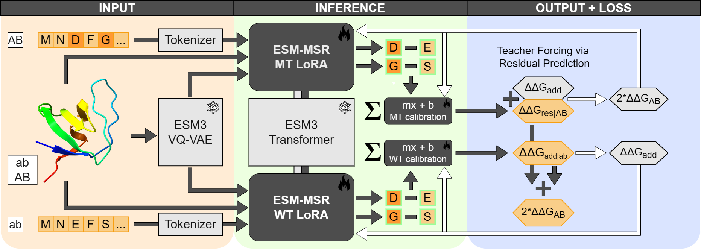
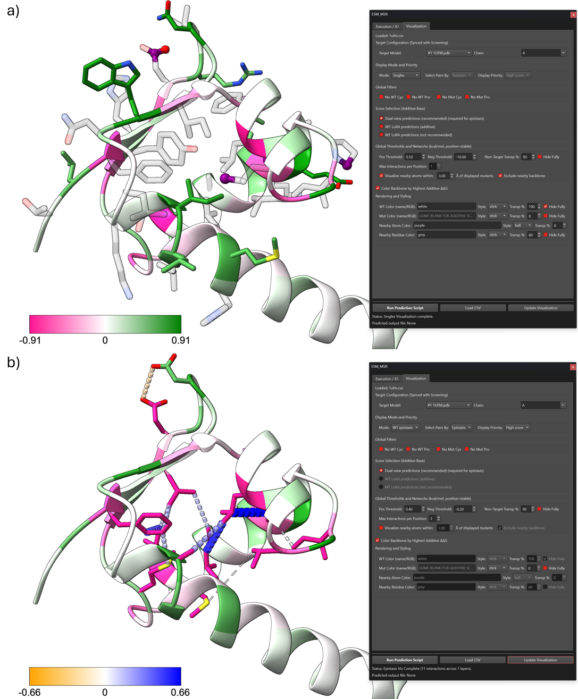

# ESM-MSR

This mutant stability predictor was created by parameter-efficient fine-tuning of ESM3-small-open (https://www.science.org/doi/10.1126/science.ads0018) on protease susceptibility assays from Tsuboyama et al. (https://www.nature.com/articles/s41586-023-06328-6). It generates state-of-the-art predictions on numerous benchmark datasets including S461 and PTMUL-D. This repository is designed to enable fast inference using this approach and facilitate reproducing results from our paper, currently in pre-print. We also created an interface for inference and visualization in ChimeraX. You can read the accompanying preprint here: https://www.biorxiv.org/content/10.64898/2026.06.04.730231v1.



## Requirements

Python 3.11-3.13 [Download Python](https://www.python.org/downloads/windows/)

CUDA 12.8 if using GPU-accelerated inference

NVIDIA GPU with 24+ GB VRAM for training, 8GB is likely sufficient for low batch size inference. Inference can also be done on a CPU (very slowly).

ChimeraX if intending to use the graphical user inference (GUI) and visualization tool: [Download ChimeraX](https://www.cgl.ucsf.edu/chimerax/download.html).

Tested extensively on Python 3.12, CUDA 12.8, ChimeraX 1.10.

Installation time: 10 minutes to clone repository and setup virtual environment. An additional 10 minutes is required to install ChimeraX and the ESM-MSR plugin. Downloading additional LoRAs from HuggingFace can be done concurrently.

## Demo Information

All steps below are required to complete the demo, except "Basic Usage - Command Line Interface (Skip if using ChimeraX GUI)". The end of the README, starting from "Using the ChimeraX GUI", is the demo. The expected output is visually indicated at the end of the file (equivalent to Figure 6 in the manuscript)

## Recommended Installation

## Windows Set-up from Zero:

1. Download and install Python version 3.11-3.13: [Download Python](https://www.python.org/downloads/windows/). Be sure to check the "Add python.exe to PATH" box before clicking "Install Now".

2. Download the .zip version of this repository from the top left of this GitHub page (or clone it if you have installed Git for Windows).

3. Extract the repository where you would like the program to be installed.

4. Inside the esm-msr folder in File Explorer (you should see pyproject.toml), click on the address bar and type "cmd" to open a command prompt in the repository location.

5. Enter the following commands (you can cut and paste):

```
python -m venv msr_venv python=3.12
.\Scripts\activate.bat
pip install torch
pip install -e .
```

Your Python environment is now setup, but you still need to obtain the ESM3 base model and install the tool in ChimeraX to use the GUI. See below.

## Linux Command Line Setup with CUDA GPU acceleration:

Clone the repo, create a conda environment, and install in editable mode:

```
git clone https://github.com/SKTeamLab/esm-msr.git
cd esm-msr
conda create -n msr_venv python=3.12
conda activate msr_venv
pip install torch torchvision torchaudio --index-url https://download.pytorch.org/whl/cu128
pip install -e .
```

## Obtaining ESM3-small-open weights

Weights are available from [HuggingFace](https://huggingface.co/biohub/esm3-sm-open-v1).

From here you have two options:

1. Allow the environment package `esm` to handle the model download and possible updates. No action is required unless ESM/Biohub changes this access mechanism.
2. Alternatively: download all files in the `data/weights` HuggingFace repo to your machine. If you have git installed, the easiest way is to use `git clone https://huggingface.co/biohub/esm3-sm-open-v1`. You will need to enter this location into the CLI or GUI.

## Basic Usage - Command Line Interface (Skip if using ChimeraX GUI)

You should now have everything you need to make your first predictions from the command line, except for a pdb/mmcif structure of interest, which you should download if following this step.

We include a small version of our LoRA model in this repository for convenience, which is used in the example below. If you want to use other models, please see our [HuggingFace page](https://huggingface.co/sareeves96/esm-msr), download the models to the LoRA_models folder, and change the path specified in the command.

Inference strategies, performance and compute time are discussed in the paper. The below command is a fast approximation of single mutant saturation mutagenesis that should take less than a minute even on a CPU, apart from loading the model weights which is very hardware dependent.

`python src/esm_msr/inference.py --checkpoint_path LoRA_models/esm-msr-small/epoch\=03-val_rho_combined_avg\=0.816.ckpt --pdb_file path_to_your_structure_file --mode singles --skip_reverse --output_csv ./example_output.csv`

Or, if you want to directly use a PDB structure:

`python src/esm_msr/inference.py --checkpoint_path LoRA_models/esm-msr-small/epoch\=03-val_rho_combined_avg\=0.816.ckpt --code 1A0F --chain A --mode singles --skip_reverse --output_csv ./example_1A0F.csv`

Remove the `--skip_reverse` flag for a much slower, slightly higher accuracy screen (proportional to total possible mutations). Change the screening `--mode` to `singles+doubles` to screen all double and single mutants (the singles are comparatively almost free and useful for visualization later). It is not recommended to use `--skip_reverse` for `--mode doubles` because this ignores epistasis. A full double mutant screen on a protein greater than 200 residues is very compute expensive. It is therefore recommended to screen only double mutants where the wild-type residues are within 6 Angstrom heavy atom distance. This is controlled with the `--distance_threshold` parameter. Multi-mutants must be screened individually, either by generating an `--input_csv` with columns `pdb_file, code, chain, mut_type` and mutations (`mut_type`) specified like A2C:D3E, or individually passing in comma separated mutations via `--mutations`. An example can be seen in `data/preprocessed/ptmul_mapped.csv`; extra columns are allowed.

The visualizer generates predictions using this script. You can read the GUI section to understand how `inference.py` can be used from the command line.

## Reproducing Benchmarks

If you want to reproduce the benchmarks without running preprocessing, you can download the relevant data from Zenodo (https://doi.org/10.5281/zenodo.21539277; `preprocessed_data.tar.gz`), place the contents in the data folder, and then run this command:

`python inference_scripts/esm_msr_testing.py --checkpoint esm-msr-small/epoch=03-val_rho_combined_avg=0.816.ckpt --split hyperopt_splits --local_path_to_structures path_to_structures_from_zenodo`

Note that the model selected here is included in the repo due to its small size and will have very similar performance to the one used in the paper, but the exact model(s) must be downloaded from HuggingFace and the `--checkpoint` argument must be updated accordingly. Benchmarking will take at least an hour even on a powerful GPU.

## Adding the Visualizer to ChimeraX

*Note: if using Windows Subsystem for Linux (WSL), it is recommended to install ChimeraX on Windows, not WSL. Everything should work even if you installed ESM-MSR into WSL.*

1. Download, install, and open [ChimeraX](https://www.cgl.ucsf.edu/chimerax/download.html) (free for non-commercial use):
1. Go to Tools -> Command Line Interface (check box if not checked)
2. In the command line interface at the bottom, type (replacing the `/path/to/repo`): `devel install /path/to/repo/ChimeraX-ResidueScoreVisualizer`

## Using the ChimeraX GUI

Load a valid protein structure (PDB, mmCIF) into ChimeraX. You can click and drag structure files into the window, or directly open a PDB structure (e.g., `open 1enh`) via the ChimeraX command line. Open the GUI, located in the Tools tab under Visualization (ESM_MSR_Visualizer). The GUI workflow is split into three main tabs: **Execution / IO**, **Screening Config**, and **Visualization**. The tool automatically remembers your most recent paths and configuration settings between sessions. You must fill out the first two tabs before hitting **"Run Prediction Script"**, and you must have a valid output (esp. by running the script) before you can complete the third tab and visualize the predictions with the **"Load CSV + Visualize Scores"** buttom.

### 1. Execution & IO (Environment & Models)

**Environment & Paths:**
* **Base Repo Dir:** Browse to the root of your cloned `esm-msr` folder. *Note: Setting this automatically populates the Python Env and Output CSV fields if they are currently empty. If you followed the instructions, the paths should be correct.*
* **Python Env:** The environment used to run inference. *WARNING: if you used a conda environment, replace the path with just the name e.g. `msr_venv`.*
* **Output CSV:** Where the resulting predictions will be saved.
* **ESM3 Weights Location:** If you want to use locally stored weights, enter the location here.


**Compute Environment & Model Configuration Files:**
* **Compute Device & Batch Size:** Select your hardware (`cuda`, `mps`, `cpu`) and batch size. Lower the batch size if you encounter CUDA Out-Of-Memory (OOM) errors. Use `cpu` unless you configured CUDA during setup and have an Nvidia GPU.
* **Checkpoint (.ckpt/.safetensors):** Select the trained LoRA checkpoint, for example the one stored in LoRA_models/esm-msr-small in this repo, or any of the checkpoints available from our HuggingFace page.
* **LoRA Config (JSON/YAML):**  When you use the "Browse" button to select a Checkpoint, the GUI will automatically assume the configuration file is named `hparams.yaml` and is located in the same parent directory. It will warn you in red text if either file is missing or contains a dangling path reference. Architectural parameters (adapter mode, lora mode, rank, alpha) are automatically parsed from this file during inference.

### 2. Screening Config

This section defines exactly which mutations will be evaluated on your structure.

**Target Selection:**
Select which open ChimeraX model and specific chain you want to predict on.

**Mutation Scope (Mutually Exclusive):**
Select **one** of three methods to define the mutation space. Selecting one method will automatically disable the inputs for the others.
1. **1. Full Screen:** Exhaustively scores mutations. Choose `singles`, `singles+doubles`.
   * *Positions:* Leave empty for all residues, or type indices manually (e.g., `11,12`). You can also select residues in ChimeraX (ctrl + click + drag) and click **Grab Selection**.
   * *Filter doubles by distance (Å):* If you are screening `singles+doubles`, you can check this box to strictly evaluate pairs of residues that are within a certain 3D spatial proximity based on minimum side-chain heavy atom distance.
2. **2. Specify mutations in CSV:** Upload a predefined CSV list of mutations to score.
3. **3. Input Mutations Directly:** Manually type a comma-separated list of precise mutations (e.g., `A12C,A12C:D15E`).

**Screening Parameters:**
* **Mask Strategy:** Choose between `Default (unmasked)`, `marginal`, or `chain`. `unmasked` tends to perform best, but there are compute savings especially if only specifying a few positions using `chain`. `marginal` is not recommended.
* **Skip MT pass (Use Additive Approximation):** Fast approximation, especially suitable for single mutants. *Warning: Skips generating `mt_lora` predictions.*

**Running Inference:**
Click **Run Prediction Script** at the bottom of the window. A red **STOP** button will appear, which allows you to forcefully terminate the process tree if you accidentally launch a massive screening run. After preliminary setup (~1 minute or possibly much longer if downloading ESM3 weights for the first time), you can track the screening progress at the bottom of the GUI, stop, and modify the run parameters if it will take too long. *Note: Singles screening or using the additive approximation takes <1 minute on modern GPUs. Doubles screening on a 300AA protein can take hours (`independent` masking) or days (`unmasked`).*

### 3. Visualization

Once inference completes (or if you load an existing output CSV), navigate to the **Visualization** tab to map the stability and epistatic scores onto your 3D structure.

**Note on Requirements:** *Single-mutation data is required for all visualization modes* to properly map additive stability scores onto sidechains.

**Target Selection:**

Confirm that you will apply the visualization to the correct chain entity. If you are visualizing a newly created result, this should be auto-populated to the correct value.

#### Core Configuration
The central paradigm is to visualize either singles, doubles, or interactions that are outside of the thresholds defined in the next section.
* **Display Mode:** Choose the primary visualization strategy:
  * **Singles:** Visualizes independent single mutations.
  * **WT Epistasis:** Visualizes epistatic interactions between wild-type residues by asssessing truncation to Alanine (or Glycine). Mapped directly onto the native WT geometry; residue colors indicate effects of mutation to alanine.
  * **MT Epistasis:** Visualizes epistatic interactions between mutant pairs, utilizing dynamically generated structural layers to resolve overlapping geometry.
* **Select Pairs By:** Determines the metric used to filter and sort interactions (either the raw Epistasis ΔΔΔG score, or the total Double Mutant Stability score).
* **Display Priority:** Determines which interactions to keep when the "Max Interactions" cap is hit. You can prioritize by High score (highest predicted stability change), Low score, or Magnitude (absolute value).
* **Global Filters:** Quickly exclude specific mutations from the visualization to clean up the display. Note that No MT Cys is especially useful to mitigate false positives caused by assay bias.
* **Score Selection (Additive Base):** Select which raw additive score to use as the base metric (Dual-view, WT LoRA, or MT LoRA). *Note: Dual-view is required for epistasis. If you skipped the MT pass during inference, only WT LoRA predictions will be available.*

#### Global Thresholds and Networks
* **Pos/Neg Thresholds:** Only mutations or epistatic pairs with scores strictly greater than the Positive Threshold or less than the Negative Threshold are visualized. Setting the negative threshold to -10 will effectively filter out al destabilizing mutants.
* **Non-Target Chain Transp %:** Adjusts the opacity of opposing chains in the complex to reduce visual clutter.
* **Max Interactions per Position:** (Epistasis modes only). Caps the number of epistatic network edges that can originate from a single residue to prevent visual overload (the "hairball" effect).
* **Visualize Contacts:** Shows surrounding wild-type contextual residues within a specified Angstrom radius of the visualized mutant sidechains. 
  * Contacting atoms are explicitly highlighted based on your styling preferences.
* **Color Backbone by Highest Additive ΔΔG:** (Singles & WT Epistasis mode only). Colors the wild-type ribbon backbone on a Pink-to-White-to-Green gradient based on the highest-scoring candidate at each position.

#### Rendering and Styling
Customize the color, geometry style (stick, ball, sphere, wire), and transparency of the structural components.
* **WT Style:** Applies to the "ghost" wild-type residues left behind for structural context, so you can assess "is this mutation really a better fit?".
* **Mut Color / Style:** Applies to the mutated sidechains. **LEAVE BLANK FOR ADDITIVE SCORE** to automatically color the mutant carbons based on their individual stability score (Pink-to-White-to-Green gradient).
* **Contact Style:** Applies explicitly to the surrounding context residues.

#### Color Mapping Guide
When using the default styling (leaving the Mut Color blank), the visualizer generates dynamic colorbars mapped to your data:
* 🟩 **Green (Atoms/Backbone):** Favorable additive single-mutant stability (score > 0).
* 🟥 **Pink (Atoms/Backbone):** Unfavorable additive single-mutant stability (score < 0).
* 🟦 **Blue (Pseudobonds):** Positive epistasis / synergistic interaction (score > 0).
* 🟧 **Orange (Pseudobonds):** Negative epistasis / antagonistic interaction (score < 0).

### Expected Output

Examples are shown below after loading the CSV under the indicated settings for the structure `1UFM`. The expected runtime for this example is 1 minute for inference on an NVIDIA GPU or 5 minutes on a CPU in addition to up to two minutes to load visual elements in ChimeraX.


