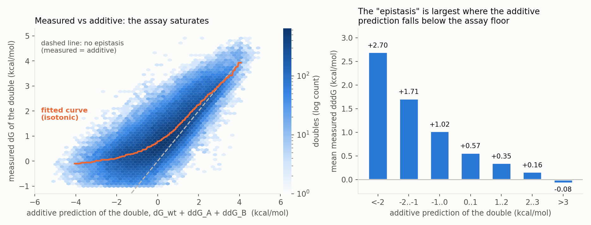
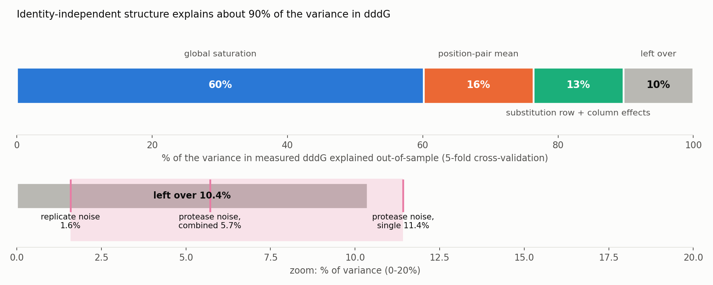
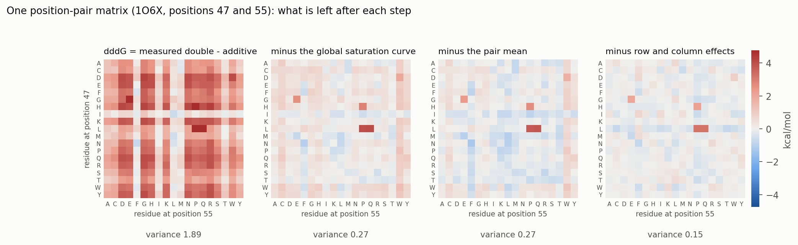
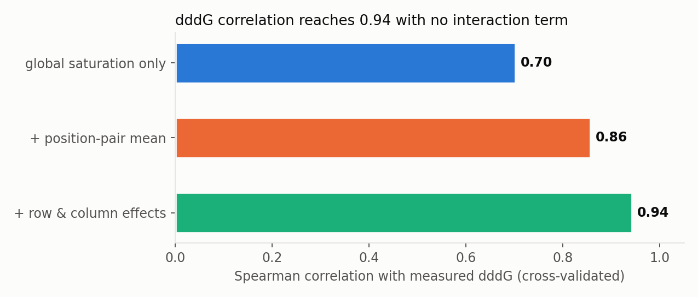
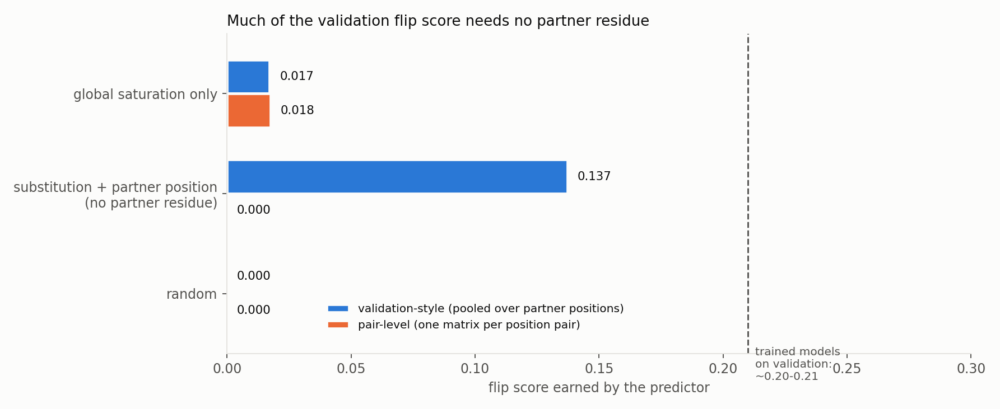

# How much of "epistasis" in the MegaScale doubles is identity-specific?

*A variance-partition (ANOVA-style) analysis of 127,476 measured double mutants. Written for
a reader who knows the project but not the statistics. Everything here is computed from the
measured data alone; no model is involved except where a model number is quoted for comparison.*

Reproduce with `analysis_notebooks/anova/` (scripts listed at the end). Raw numbers are in
`docs/anova/results.json` and `docs/anova/splithalf.json`.

---

## 0. Summary

1. **About 90% of the variance in the usual epistasis score (ΔΔΔG) is explained by structure that
   does not depend on which two amino acids were swapped.** Out-of-sample: 60% by the assay's
   saturation alone, +16% by a per-position-pair offset, +13% by per-substitution row and
   column effects. (Figure 2.)
2. **What is left (10.4%) is small, and about the size of the measurement noise.** The most direct noise measurement for mutants,
   replicate rows of the same mutant (SD **0.27** kcal/mol, 4,552 mutants), agrees with the trypsin-versus-chymotrypsin disagreement (0.22–0.31); both put
   5.7–11.4% of the variance in the leftover as noise, leaving **about 0–5%, most likely about 2%**, for identity-specific interaction. Synonymous
   wild-type copies give a much lower SD (0.115), which would leave up to 9%, but wild-type sequences are measured at far greater depth than a typical mutant, so
   that figure understates mutant noise (Sections 2 and 4.3). Earlier versions of this report gave 0–5%, then 0–9%, depending on which estimate was used.
3. **ΔΔΔG correlation is not a test of interaction.** Predictors with no identity-specific term
   at all reach Spearman 0.70, 0.86 and 0.94 against measured ΔΔΔG (Figure 4). The validation
   metric `val_rho_epi` (about 0.36–0.42) is therefore not evidence of learned interaction.
4. **The validation flip metric partly rewards something other than partner-residue interaction.**
   A predictor that knows the scored substitution and the partner *position*, but nothing about
   the partner *residue*, earns a validation-style flip score of **0.137**. Trained models score
   about 0.20–0.21. On a stricter per-position-pair version of the metric that predictor scores
   exactly 0. (Figure 5.)
5. **The capability test agrees with the modest gains.** Adding the rank loss raised the flip score
   on *training* libraries by +0.049 (19 of 21 libraries improved) but on validation libraries by only
   +0.015 (6 of 16 improved, indistinguishable from zero).
6. **Including the out-of-range variants** (Section 3.5) raises the saturation share to 66% and leaves the leftover at
   8.6%, which is within the plausible range of noise.
7. **What would be a cleaner target:** the per-pair-matrix version of the flip metric, and a loss
   that works on the residual after the identity-independent terms are removed (Section 6).

---

## 1. Background (no prior knowledge assumed)

### 1.1 The measurements

The MegaScale experiment measures how stable thousands of small proteins are. Stability is
reported as ΔG in kcal/mol (higher means more stable). A *mutation's* effect is
ΔΔG = ΔG(mutant) − ΔG(wild type), so a destabilizing mutation has negative ΔΔG.

A *double mutant* changes two positions at once. If the two changes acted independently, the
double's effect would be the sum of the two single effects:

> additive expectation = ΔΔG_A + ΔΔG_B

**Epistasis** is any departure from that. The score used throughout this project is

> ΔΔΔG = ΔΔG_AB − ΔΔG_A − ΔΔG_B   (all measured; I write it **dddG** in figures and tables)

Positive dddG means the double is more stable than the additive expectation.

### 1.2 Variance, "% explained", and why we cross-validate

*Variance* is a measure of spread: the average squared distance of values from their mean.
Here Var(dddG) = 0.83 (kcal/mol)², a standard deviation of 0.91 kcal/mol.

If a predictor accounts for part of that spread, the fraction of variance **explained** is
R² = 1 − (variance left in the prediction errors) / (total variance). R² = 1 is perfect and
R² = 0 is no better than always guessing the mean.

An R² computed on the same data used to build the predictor flatters it, because the predictor
can adapt to noise. We therefore report **cross-validated** R²: the data are split into five random folds, the predictor is fitted on four folds
and scored on the fifth, and the five scores are pooled. That measures how well a rule
generalizes to cells it did not see.

*Spearman correlation* (ρ) compares only the ranking of values, not their size: 1 means identical
order, 0 means unrelated order. It is what most of this project's validation metrics use.

### 1.3 What "ANOVA" means here

ANOVA ("analysis of variance") is the idea of splitting the total spread in a quantity into pieces
attributable to named factors, so you can say "this factor accounts for X% of the variation". Done
one factor at a time, in a fixed order, each step reports how much *additional* variance the
next factor explains. The order matters (a factor listed earlier gets credit for anything it
shares with later ones), so I state the order and justify it: coarse, protein-independent
effects first, then increasingly specific ones.

### 1.4 The pieces

For one pair of positions (p, q) in one protein, collect every measured double: one residue
choice *a* at p and one *b* at q. That gives a grid ("matrix") with up to 19 × 19 = 361 cells
(Figure 3 shows one). The dddG in each cell is split into:

| piece | what it is | depends on the residues a, b? |
|---|---|---|
| **global saturation** | The assay cannot report ΔG outside about −1 to +5, so doubles that *should* be very unstable are measured higher than additivity predicts. It is a smooth, increasing function of the additive prediction, the same for every protein. | no |
| **position-pair mean** | One constant offset for the whole grid: this pair of positions couples a bit more or less than average. | no |
| **row effect** | A constant for each *a*, shared across the whole grid: "substituting to a at p behaves unusually when position q is also mutated". | only via a |
| **column effect** | The same for each *b*. | only via b |
| **interaction** | What is left after the four pieces above: the part that depends on the *specific combination* of a and b. This is what the MT adapter is meant to learn. | yes |
| **measurement noise** | Random error in each measured ΔG. | n/a |

"Global saturation" is estimated by **isotonic regression**: draw the best non-decreasing curve
through the scatter of measured ΔG against the additive prediction (Figure 1). It is flexible (no
assumed shape) but forced to go up, which is what a saturating assay does.

Row and column effects also soak up the measurement errors of the two **single** mutants: dddG
subtracts the measured ΔΔG_A, so any error in that one measurement shifts every cell in A's row by
the same amount. This is why single-mutant noise cannot masquerade as interaction in the leftover.

---

## 2. Data and method

* Source: the project's Tsuboyama MegaScale table with the main training filters (no wild-type, insertion
  or deletion rows; the one flagged mislabelled library removed; duplicate measurements averaged).
  Training also drops a few other flagged rows that I did not replicate, so counts differ slightly from the training set.
* Doubles are kept when **both** singles were also measured: **127,476 doubles, 153 libraries, 481
  position pairs**, median 313 of 361 possible cells per pair. 
* Additive prediction x = ΔG_wt + ΔΔG_A + ΔΔG_B; measured double ΔG = ΔΔG_AB + ΔG_wt;
  dddG = measured − x.
* Hierarchy, each level cross-validated at the cell level (5 folds):
  **M1** isotonic curve of measured ΔG on x. **M2** M1 plus a per-pair mean of what M1 leaves.
  **M3** M2 plus per-pair row and column effects (fitted by alternating averages).
* **Measurement noise: four estimates, which disagree.**
  (a) *Replicate noise.* Each library contains several synonymous copies of the wild-type sequence (median 5). Their ΔG spread
  directly measures replicate error: median SD **0.07**, pooled SD **0.115 kcal/mol** across 419 libraries. It misses error that is the same
  for every copy of a sequence, such as an error in the model of the unfolded-state baseline.
  (b) *Mutant replicates.* 4,552 mutants appear in two or more rows of the table (the same amino-acid sequence under different DNA, measured in
  different library entries). Their dG_ML spread is the most direct measurement of mutant noise: pooled SD **0.27** kcal/mol (median per-mutant SD 0.17), flat across
  the stability range (0.25 to 0.31 in each bin). It is much higher than the wild-type copies because wild-type sequences are measured many times over
  and so at far greater depth; it still misses errors shared by all copies of a sequence.
  (c) *Protease disagreement.* The two protease-based ΔG estimates (trypsin, chymotrypsin) are
  independent measurements of the same quantity. Their disagreement, in the well-measured range
  (0 < ΔG < 4), is SD(difference)/√2 = **0.31 kcal/mol per protease**. The project's ΔG is a
  combination of the two, which would reduce the error to about **0.22** if their errors were independent.
  I use 0.115 (wild-type copies), 0.22, 0.27 (mutant replicates) and 0.31 as the bracket. (d) The reported 95% confidence intervals
  (median width 0.14, so SD about 0.04) are a floor, not an estimate: the paper's methods state they reflect only
  the uncertainty from finite sequencing counts and exclude uncertainty in the unfolded-state baseline K50,U,
  protease concentrations and the validity of the kinetic model. The protease disagreement includes those
  protease-specific errors; errors shared by both proteases would not show up in it.
* **Out-of-range variants are not in this data.** The table stores a variant whose ΔG is confidently below −1 or
  above 5 as the text `<-1` or `>5`, which numeric parsing (mine, and the training pipeline's) turns into a
  missing value. Among doubles whose singles are measured, **5.9% (8,356 of 140,846) are missing this way**,
  and the loss is concentrated where the additive prediction is lowest: **38%** of doubles with additive
  prediction below −3, 24% for −3 to −2, 14% for −2 to −1, and under 1% above 0. Section 7 explains what that does
  to the results.

---

## 3. Results

### 3.1 The assay saturates, and that is where most "epistasis" comes from

*Figure 1.* Left: measured ΔG of each double against its additive prediction. If there were no
epistasis the cloud would follow the dashed line. It bends away from it: doubles predicted to be
very unstable are measured near the assay floor (orange curve). Right: mean dddG by additive
prediction. Where the additive prediction falls below about −2 kcal/mol, the average "epistasis" is
**+2.7 kcal/mol**, an artifact of the floor and not an interaction.

### 3.2 How the variance divides

*Figure 2.* Top: share of the variance in measured dddG explained out-of-sample at each step.
Bottom: zoom on the leftover, with the amount that measurement noise alone would contribute under the three noise
estimates of Section 2 (pink markers).

| step | explains (cross-validated) | cumulative | in-sample (for contrast) |
|---|---|---|---|
| global saturation (M1) | **60.1%** | 60.1% | 60.3% |
| + position-pair mean (M2) | +16.2% | 76.3% | 76.6% |
| + row and column effects (M3) | +13.3% | 89.6% | 92.8% |
| **left over** | **10.4%** | | 7.2% |

The in-sample figure for the last step (92.8%) is higher than the cross-validated one (89.6%) because
row and column effects are fitted from a handful of cells and partly fit noise. The cross-validated
number is the honest one.

### 3.3 A single matrix, step by step

*Figure 3.* One position-pair matrix (library 1O6X, positions 47 and 55). Red cells are more stable
than additive, blue less. Panel 1 is raw dddG (variance 1.89). Removing the saturation curve cuts
it to 0.27; most of the structure was global. Subtracting the pair mean does not change the variance
*inside one matrix* (a constant shift), but in the pooled analysis it removes the differences *between*
pairs. Removing row and column effects leaves 0.15. What remains is faint, with a few isolated cells
(for example leucine at 47 paired with proline or glutamine at 55). Those isolated cells are the
kind of thing identity-specific interaction looks like.

### 3.4 The conventional metric can be maxed out without interaction

*Figure 4.* Spearman correlation of each cumulative predictor with measured dddG. None contains
a term that depends on the specific pair of residues. Rank correlation with ΔΔΔG is therefore not
informative about interaction, which agrees with the simulations in FINDINGS §1.

**Caveat on comparability.** These predictors use *measured* singles and (for M2/M3) the
measured cells of the same matrix, which a sequence model does not have. They are ceilings for
what identity-independent structure can explain, not models. For the project's own validation
libraries (16 libraries, 8,537 doubles) the saturation curve alone, fitted on training libraries only,
gives ρ = 0.70 pooled and **0.57 averaged per library**, against the old `val_rho_epi` of about 0.36–0.42
(which also has to predict the singles from sequence).

---

### 3.5 Sensitivity: including the out-of-range variants

Section 2 notes that variants confidently outside the assay range (`<-1`, `>5`) are missing from the table
the project uses. I reran the whole analysis with them included at the clipped bounds (−1 and 5), as the paper does for its
own figures. Doubles that contain a clipped single now enter too, so the sample grows from 127,476 to **166,996 doubles**
(166 libraries, 504 position pairs). Raw numbers: `docs/anova/results_clipped.json`.

| | survivors only (main analysis) | clipped bounds included |
|---|---|---|
| variance of dddG | 0.83 | 1.18 |
| global saturation | 60.1% | **65.9%** |
| + position-pair mean | +16.2% | +14.2% |
| + row and column effects | +13.3% | +11.3% |
| **left over** | 10.4% | **8.6%** |
| noise expected in the leftover (σ 0.115 / 0.22 / 0.31) | 1.6% / 5.7% / 11.4% | 1.1% / 4.0% / 8.0% |
| room for interaction | about 0% to 8.8% (about 1.6% at the mutant-replicate noise) | about 0.6% to 7.5% (about 2.4% at the mutant-replicate noise) |
| ρ with dddG: saturation only / + pair mean / + row, col | 0.70 / 0.86 / 0.94 | 0.74 / 0.87 / 0.95 |
| saturation-only ρ on validation libraries (per-library mean) | 0.57 | 0.60 |

* The share explained by **saturation rises**, as expected: the doubles that were missing are the ones most affected by the floor.
* The **bottom line is unchanged**: after the identity-independent terms, the leftover is about what noise alone would give,
  leaving at most about 7–9% of the variance for identity-specific interaction, and little or none under the higher noise estimates.
* Caution: a clipped value is a bound, not a measurement, so cells built from clipped values carry extra structured error.
  The absolute leftover variance is slightly higher here (0.10 versus 0.086 kcal²/mol²), which is consistent with that.

## 4. Interpreting the leftover

### 4.1 It looks like noise

Section 2 gives four estimates of the measurement error. Total noise in dddG is three times the single-measurement variance
(the double plus the two singles): 4.8% of the variance for σ = 0.115, 17% for σ = 0.22, 26% for σ = 0.27 and 34% for σ = 0.31. Most of it, the single-mutant part, ends up in the row
and column effects and is already removed. Only the *double's own* measurement error stays in the leftover:
**1.6%**, **5.7%**, **8.8%** or **11.4%** of the variance. The leftover is **10.4%**: the mutant-replicate estimate (8.8%) accounts for most of it.

### 4.2 By how far down the additive prediction sits

| additive prediction x | doubles | mean dddG | variance of dddG | variance left after M3 |
|---|---|---|---|---|
| < −2 | 8,478 | +2.70 | 0.52 | 0.134 |
| −2 to −1 | 17,342 | +1.71 | 0.36 | 0.100 |
| −1 to 0 | 28,717 | +1.02 | 0.40 | 0.092 |
| 0 to 1 | 34,822 | +0.57 | 0.35 | 0.069 |
| 1 to 2 | 23,982 | +0.35 | 0.34 | 0.071 |
| 2 to 3 | 10,965 | +0.16 | 0.30 | 0.078 |
| > 3 | 3,170 | −0.08 | 0.36 | 0.149 |

In the middle of the range (where the assay is best behaved), the leftover variance is 0.07 kcal²/mol²
(SD 0.26), the same scale as the noise estimates (SD 0.22–0.31). It is larger at both ends, where the assay is
least reliable.

### 4.3 How large is the interaction share? It depends on the noise level

The leftover minus the expected noise is the most that real interaction could account for:

| assumed noise SD (kcal/mol) | source | noise in leftover | room for interaction |
|---|---|---|---|
| 0.31 | pessimistic: one protease's disagreement | 11.4% | about 0% |
| **0.27** | **replicates of the same mutant (most direct)** | **8.8%** | **about 1.6%** |
| 0.22 | optimistic: combined estimate, independent protease errors | 5.7% | about 4.7% |
| 0.115 | synonymous wild-type copies (deep coverage; understates mutant noise) | 1.6% | about 8.8% |

So the data constrain interaction to a small share of the variance. The two measurements most relevant to mutants (replicates of the same mutant, 0.27, and
protease disagreement, 0.22–0.31) agree and leave about 0–5% (most likely about 2%). The wild-type copies would leave up to 9%, but they overstate how
well a typical mutant is measured. All of these miss errors shared by every measurement of a sequence, which can only make the noise larger.

---

## 5. What this means for the model and the validation metric

**5.1 Validation ΔΔΔG metrics.** Spearman against measured dddG (`val_rho_epi_fast`,
`val_rho_epi_full`) is dominated by saturation. A model gets credit for modelling the assay
floor, not for interaction. Use it as a calibration check, not as evidence of epistasis.

**5.2 The flip metric includes something other than partner-residue interaction.**
In the code, `val_rho_flip` builds each matrix from the column key `code|scored position|partner
position+residue`. The matrix is therefore indexed by the *scored position* and pools columns
across **different partner positions**, so a substitution's average behaviour *with a particular partner position* counts as signal.
FINDINGS describes its test docket as one matrix per position pair, where this term cannot contribute.

*Figure 5.* A predictor built from the measured data that knows *which substitution is scored* and
*which position the partner is at*, but nothing about the partner residue, scores **0.137** on the
validation-style metric (three random splits: 0.1373, 0.1370, 0.1374) and exactly **0** on the per-pair
version. The predictor is the mean over a disjoint half of the partner residues, so it never sees
the cell it predicts. Trained models score 0.20–0.21 on validation; the saturation curve alone
scores 0.017. Part of the validation flip score can therefore be earned without any knowledge of
which residue the partner is.

This is an upper bound on what is attainable without partner-residue information, since the predictor
uses measured data from the same matrix; a model has to learn such position-specific substitution effects from sequence.
Still, it means a rise in `val_rho_flip` can come from position-specific rather than residue-specific
effects.

**5.3 The capability test.** Epoch-2 checkpoints of the flip-loss run and the no-flip control, same
pipeline on both splits (my validation numbers reproduce the logged 0.213 and 0.205):

| | validation libraries (16) | training libraries (21, random sample) |
|---|---|---|
| flip loss (λ = 1) | 0.214 | 0.359 |
| no flip loss | 0.199 | 0.310 |
| paired difference | +0.015 (SE 0.023; better in 6 of 16) | **+0.049 (SE 0.013; better in 19 of 21, p = 0.004)** |

The loss does what it is designed to do on data it trained on, so this is not an implementation
failure. The effect barely transfers to unseen proteins. The train and validation libraries are
different sets, so the 0.31–0.36 versus 0.20 gap is not clean evidence of memorization; the
paired difference inside each split is the clean comparison.

**5.4 Consistency with earlier findings.** About two-thirds of the within-column rank variance is
the consensus per-substitution ordering (mean Spearman 0.78 across 4,225 columns), which the
regression already supplies. Together with the leftover above, that explains why a rank loss on top of
regression moves the validation flip score so little.

---

## 6. Suggested next steps

1. **Add a per-pair flip metric to validation** (one matrix per position pair, columns indexed by
   partner residue only), log it beside `val_rho_flip`, and select checkpoints on it. This removes
   the position-specific component. It is a small change to `stats.flip_signature_rho`.
2. **Move the nonlinearity out of the regression.** Replace the linear calibration with a monotone
   saturating link on (ΔG_wt + latent additive sum + MT term). The assay floor then becomes part of the
   measurement model instead of something the MT head has to imitate, and it pairs naturally with the
   censored loss.
3. **Train the interaction head on the residual** after the identity-independent terms (the
   deviation-targeted loss), or project the MT head's output onto the interaction subspace.
4. **Noise: done as far as the table allows.** The table holds replicate rows for 4,552 mutants (Section 2), which settle the noise at about
   0.27 kcal/mol and agree with the protease estimate. Replicates are scarce for doubles specifically, and I found no additional independent replicates in the
   Zenodo record's file listing (per-library K50/dG tables, the processed datasets, and raw sequencing counts), but I did not open the raw counts, which
   could in principle give per-experiment replicates. A double-specific noise estimate remains open.

---

## 7. Caveats

* **The identity-independent pieces are fitted from measured data**, including the measured cells
  of the same matrix and the measured singles. They show how much variance such structure *can*
  explain; they are not models a sequence network already has.
* **Row and column effects are not all "nuisance".** They include real biology (for example,
  coupling that grows with how damaging a substitution is) as well as single-mutant noise. Calling
  them identity-*independent* means they do not depend on the *partner residue*.
* **Noise is the least certain input**: the replicate-based and protease-based estimates differ by a factor of two to three (Section 4.3).
* **The low end of the data is truncated.** Doubles that are confidently below the assay floor are absent (Section 2),
  so the floor region is a survivor sample. The saturation curve and the global share (60%) there are conditioned on survivors and
  would change if those doubles were included (clipped at −1, as the paper does for its figures). The mid-range results,
  where 94–99% of doubles are present, including the leftover variance of 0.07 and its comparison with noise, are not affected
  by this. The same truncation applies to training: the deeply unfolded singles and doubles are never seen.
* **One data set and a designed experiment.** The doubles are at chosen position pairs, not random
  ones, and the saturation curve was assumed universal across proteins (protein-specific effects end up
  in the pair mean).
* **Pooled cell-level cross-validation** tests generalization to unseen *cells* of known matrices, not to
  unseen proteins, except for the validation-library baseline in Section 3.4.

## 8. Things I tried that did not hold up

* A "ceiling" for the flip metric built by adding noise to the measured values and comparing with the
  originals. It re-uses the same noise on both sides, so it overstates agreement. Removed.
* Predicting each cell from its own matrix row mean gave +0.17 on the validation-style metric. That
  figure includes the cell being predicted; leaving the cell out gives a negative bias (−0.16), the
  opposite artifact. Only the disjoint-half version (0.137) is unbiased.
* A simulated "perfect model" ceiling that put the saturation in observed space rather than latent
  space. It produced a non-zero floor from the construction itself. Not used.

## 9. Files

| file | role |
|---|---|
| `analysis_notebooks/anova/anova_variance_partition.py` | builds the doubles table, runs the cross-validated hierarchy, noise estimate, flip baselines |
| `analysis_notebooks/anova/flip_splithalf.py` | the unbiased partner-ignorant flip baseline |
| `analysis_notebooks/anova/make_figures.py` | Figures 1–5 |
| `docs/anova/results.json`, `docs/anova/splithalf.json` | all numbers quoted above |

## 10. Glossary

* **ΔG / ΔΔG / dddG:** stability; effect of a mutation on stability; departure of a double from additivity.
* **Additive expectation:** the sum of the two single effects.
* **Variance, R², cross-validation, Spearman ρ:** Section 1.2.
* **Isotonic regression:** the best non-decreasing curve through a scatter.
* **Position pair / matrix:** all doubles at two fixed positions, laid out as a grid of residue choices.
* **Row / column effect:** an average shift shared by every cell in a row (or column) of such a grid.
* **Interaction:** what is left after removing everything that does not depend on the specific pair of residues.
* **Flip metric:** rank each column of the grid, remove row, column and overall means from the ranks,
  and correlate measured with predicted; zero for any additive predictor.
